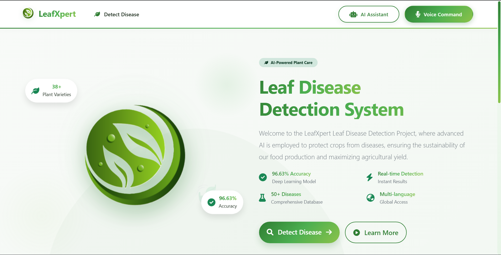
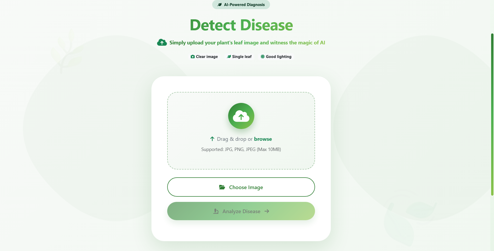
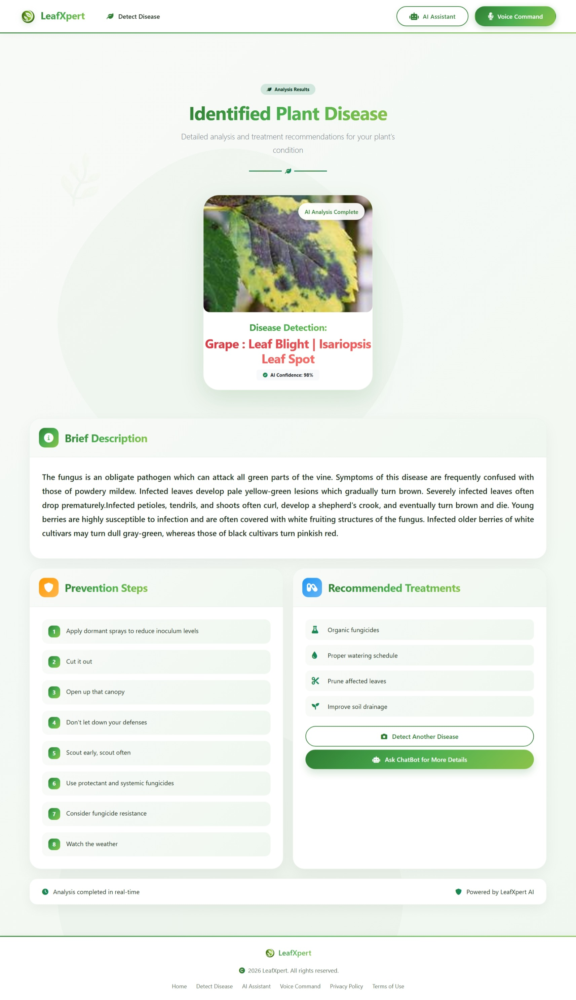
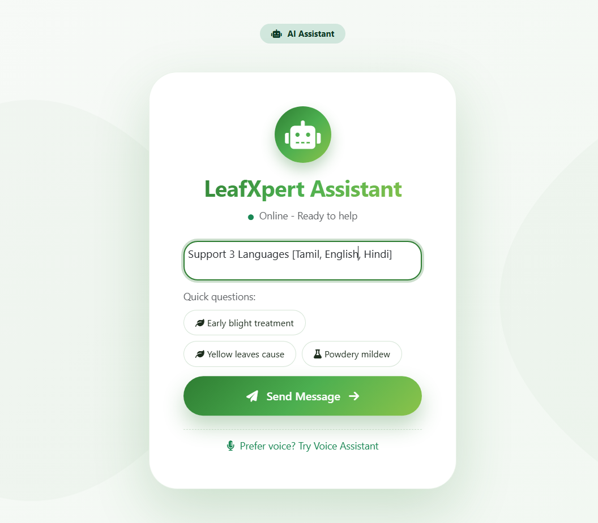
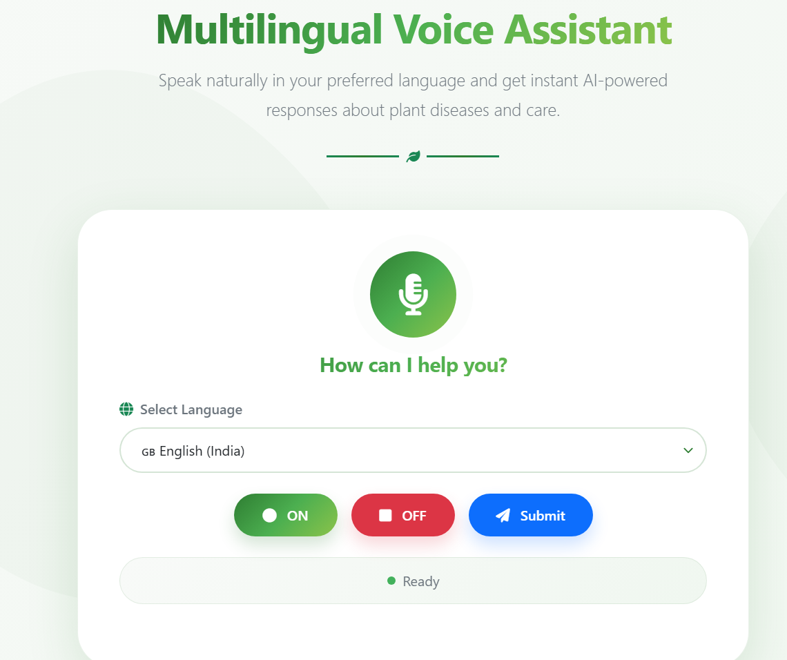

# 🌿 LeafXpert AI Plant Assistant

<div align="center">
  
  
  <h3>Intelligent Plant Disease Detection & Care Assistant</h3>
  <p>Empowering farmers with AI-powered plant healthcare in multiple languages</p>
  
  
  
  
  
</div>

---

## Overview

LeafXpert is an AI-powered multilingual plant disease detection and care assistant that helps farmers and gardeners identify plant diseases instantly and get treatment recommendations. The platform combines computer vision for disease detection with a voice-enabled chatbot that provides advice in English, Hindi, and Tamil.

## Key Features

- **AI Image Detection**: Upload plant images and get instant disease identification with 96.63% accuracy
- **Comprehensive Disease Info**: Detailed descriptions, prevention steps, and AI-powered treatment advice
- **Multilingual Voice Assistant**: Natural voice interaction in English, Hindi, and Tamil
- **Advanced AI Models**: ResNet-18 for disease detection + GPT-4o-mini for intelligent advice
- **Beautiful UI**: Responsive, animated interface with voice wave visualization
- **Farmer-Friendly**: Simple, intuitive design accessible to all users

##  Screenshots

<div align="center">
  <table>
    <tr>
      <td align="center"><strong>Home Page</strong></td>
      <td align="center"><strong>Disease Detection</strong></td>
    </tr>
    <tr>
      <td></td>
      <td></td>
    </tr>
    <tr>
      <td align="center"><strong>Detection Results</strong></td>
      <td align="center"><strong>AI Chatbot</strong></td>
    </tr>
    <tr>
      <td></td>
      <td></td>
    </tr>
    <tr>
      <td colspan="2" align="center"><strong>Voice Assistant</strong></td>
    </tr>
    <tr>
      <td colspan="2" align="center"></td>
    </tr>
  </table>
</div>

## Quick Start

### Prerequisites

- Python 3.8 or higher
- pip package manager
- Modern web browser (Chrome recommended for voice features)
- Microphone (for voice assistant)

### Installation Steps

1. **Clone the repository**

```bash
git clone https://github.com/yourusername/LeafXpert.git
cd LeafXpert
```

2. **Create and activate virtual environment**

```bash
# Windows
python -m venv venv
venv\Scripts\activate

# Linux/Mac
python3 -m venv venv
source venv/bin/activate
```

3. **Install dependencies**

```bash
pip install -r requirements.txt
```

4. **Set up environment variables**

```bash
cp .env.example .env
# Edit .env and add your OPENROUTER_API_KEY
```

5. **Run the application**

```bash
python app.py
```

6. **Open your browser**

Navigate to `http://localhost:5000`

```

## AI Models

### Plant Disease Detection
- **Model**: ResNet-18 (Fine-tuned)
- **Training Data**: 87,000+ plant images
- **Diseases Covered**: 38+ plant diseases
- **Accuracy**: 96.63%

### AI Assistant
- **Model**: GPT-4o-mini via OpenRouter API
- **Languages Supported**: English, Hindi, Tamil
- **Capabilities**: Disease treatment advice, prevention tips, general plant care

## Features in Detail

### Disease Detection
- Upload plant leaf images through simple interface
- Real-time analysis with progress indicator
- Instant disease identification with confidence score
- Detailed disease description and characteristics

### Treatment Recommendations
- Step-by-step prevention measures
- Organic and chemical treatment options
- Best practices for plant care
- Links to relevant supplements/products

### Voice Assistant
- Multilingual support (English, Hindi, Tamil)
- Real-time speech recognition
- Natural language understanding
- Text-to-speech responses with proper accent
- Voice wave animation during recording

### Text Chatbot
- 24/7 AI-powered assistance
- Quick question suggestions
- Conversation history
- Farmer-friendly responses

## API Integration

### OpenRouter API (GPT-4o-mini)

```python
response = requests.post(
    url="https://openrouter.ai/api/v1/chat/completions",
    headers={
        "Authorization": f"Bearer {OPENROUTER_API_KEY}",
    },
    json={
        "model": "openai/gpt-4o-mini",
        "messages": [{"role": "user", "content": prompt}]
    }
)
```

## Dependencies

```
Flask==2.3.3
torch==2.0.1
torchvision==0.15.2
Pillow==10.0.0
numpy==1.24.3
requests==2.31.0
python-dotenv==1.0.0
gunicorn==21.2.0  # for production
```

## UI/UX Highlights

- Nature-inspired color scheme (greens and earth tones)
- Smooth animations and transitions
- Fully responsive design (mobile, tablet, desktop)
- Voice wave visualization during recording
- Clear status indicators and progress feedback

## Configuration

### Environment Variables (.env)

```env
OPENROUTER_API_KEY=your_api_key_here
```

### Getting Your OpenRouter API Key

1. Visit [OpenRouter](https://openrouter.ai/)
2. Sign up for an account
3. Navigate to API Keys section
4. Generate a new API key
5. Add it to your `.env` file

## Testing

```bash
# Run the application in debug mode
python app.py

# Access the app at http://localhost:5000

# Test all features:
# - Image upload and detection
# - Voice assistant in all languages
# - Chatbot interactions
# - Responsive design on different devices
```


## Contributing

Contributions are welcome! Please feel free to submit a Pull Request.

1. Fork the repository
2. Create your feature branch (`git checkout -b feature/AmazingFeature`)
3. Commit your changes (`git commit -m 'Add some AmazingFeature'`)
4. Push to the branch (`git push origin feature/AmazingFeature`)
5. Open a Pull Request

### Contribution Guidelines

- Follow PEP 8 style guide for Python code
- Write clear commit messages
- Add tests for new features
- Update documentation as needed

## To-Do

- [ ] Add more plant disease classes
- [ ] Implement user authentication
- [ ] Create mobile app (React Native)
- [ ] Add weather integration for preventive care
- [ ] Implement disease history tracking
- [ ] Add community forum for farmers

## Known Issues

- Voice assistant may not work on some older browsers
- Large image uploads (>10MB) may take longer to process
- Tamil voice synthesis has limited word coverage

## License

This project is licensed under the MIT License - see the [LICENSE](LICENSE) file for details.

## Acknowledgments

- [PlantVillage](https://plantvillage.psu.edu/) dataset for disease images
- [OpenRouter](https://openrouter.ai/) for GPT-4o-mini API access
- [Bootstrap](https://getbootstrap.com/) for UI components
- [Font Awesome](https://fontawesome.com/) for icons
- All farmers and agricultural experts who provided domain knowledge

## Contact

- **Project Link**: [[https://github.com/yourusername/LeafXpert](https://github.com/yourusername/LeafXpert)]
- **Email**: ariharankc@gmail.com
- **LinkedIn**: https://www.linkedin.com/in/ariharankc07/

## Star History

If you find this project useful, please consider giving it a ⭐ on GitHub!
